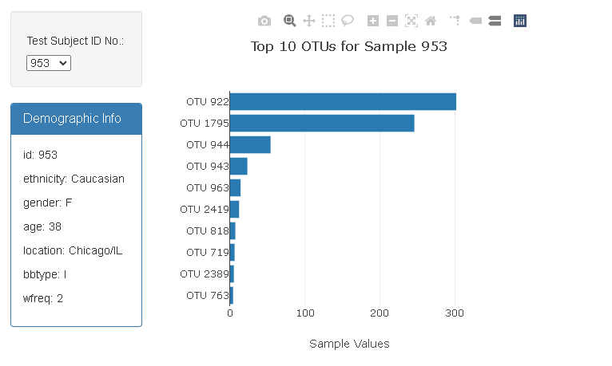
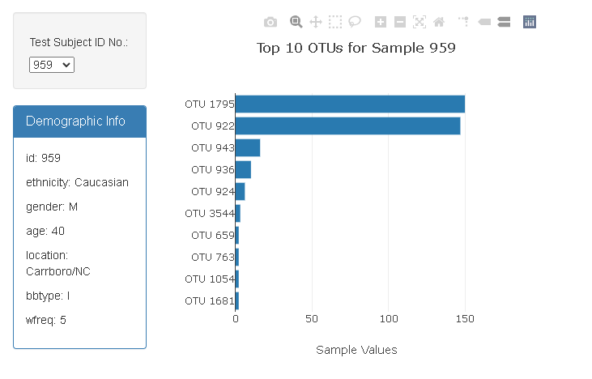
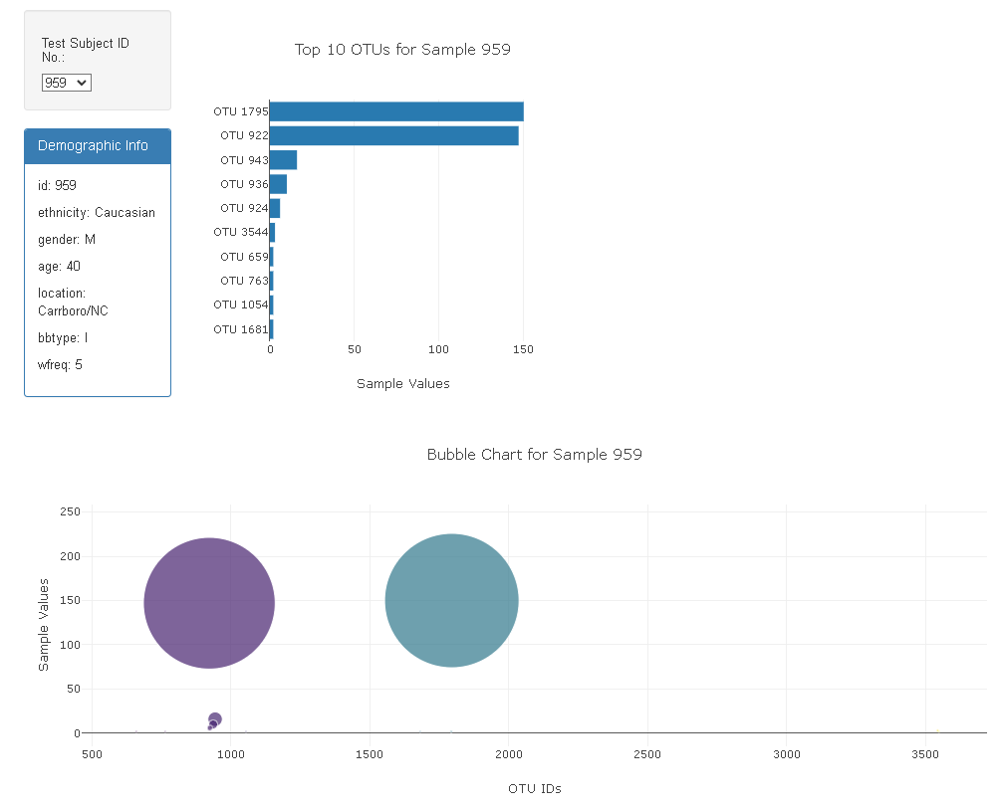
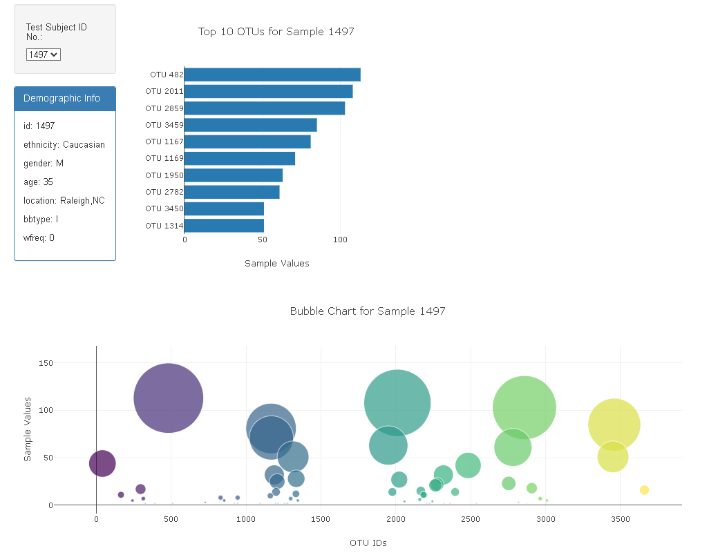

# Belly-Button-Challenge

## Bar Chart

When the drop down option changes, the bar chart updates to the top 10 OTUs for that Sample in the drop down.

## Bubble Charts

When the drop down option changes, the bubble chart updates to show the OTU IDs and sample values for that chosen Sample in the drop down.

## Metadata and Deployment
The deployment of the metadata initializes to the website with no errors and updates when a new sample is chosen in the drop down.

GitHub Pages Site: https://expopanda.github.io/Belly-Button-Challenge.github.io/

## Sources
For this challenge I used chatGPT, google, and classroom examples as reference. I was unable to successfully incorporate the gauge graph as tehre were consistant errors. I really enjoyes this challenge as it challenged my brain to do something I have never done before.
